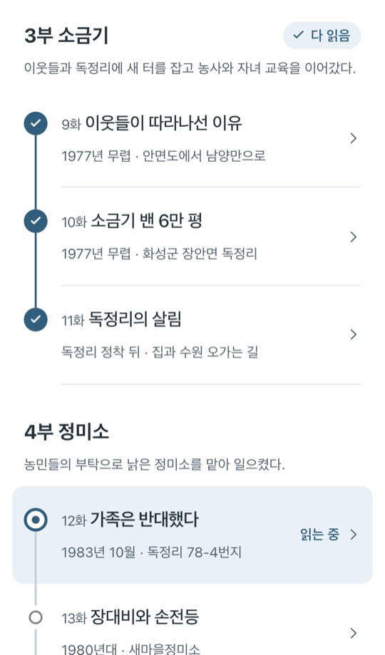

<p align="center">
  
</p>

<h1 align="center">내 논을 파는 한이 있어도</h1>

<p align="center">
  배병희 자전소설 · 가족이 휴대폰으로 함께 읽는 서재<br>
  <sub>프롤로그 · 6부 23화 · 에필로그 · 외전</sub>
</p>

<p align="center">
  <a href="https://mjbae.github.io/bae-memoir/"><b>읽으러 가기 →</b></a>
</p>

<p align="center">
  <i>“내 논을 파는 한이 있어도, 농사지은 사람 볏값은 밀려선 안 된다.”</i>
</p>

<br>

<table align="center">
  <tr>
    <td align="center" width="33%">
      <br>
      <sub><b>표지</b><br>다시 오면 소개를 접고 이어서 읽기</sub>
    </td>
    <td align="center" width="33%">
      <br>
      <sub><b>회차</b><br>수채화 삽화와 넉넉한 글씨</sub>
    </td>
    <td align="center" width="33%">
      <br>
      <sub><b>목차</b><br>읽은 곳·읽는 곳·남은 곳이 한 줄에</sub>
    </td>
  </tr>
</table>

## 이렇게 읽어요

- **가입 없이 링크 하나로** 읽습니다. 같은 브라우저가 읽던 위치와 읽은 회차를 기억하고, 회차 끝이 화면에 보이면 읽음으로 남깁니다.
- **목차 왼쪽 줄**에 읽은 회차는 ✓, 처음 읽는 중인 회차는 고리, 아직 읽지 않은 회차는 빈 원으로 보입니다. 모두 읽은 부에는 ‘다 읽음’이 붙습니다.
- **회차 끝**에는 ‘끝’ 다음에 응원해요·좋아요·뭉클해요·대단해요 반응과 이전 화·다음 화가 이어집니다.
- **설정**에서 글자 크기 네 단계(18·20·23·26px), 화면(기기 설정·밝게·어둡게), 배경음악을 고릅니다. 가장 큰 글씨에서도 설정 창이 한 화면에 들어옵니다.
- 검색, 진행률, 별점, 댓글, 하단 도구 모음은 일부러 두지 않았습니다.

원고는 [배병희_자서전.md](배병희_자서전.md) 한 파일입니다. [웹소설형 연재 개편 제안서](웹소설형_연재_개편_제안서.md)의 1단계인 원고 재배치와 서비스 개편을 마쳤고, 회당 4,000~5,000자로 넓히는 2단계 소설화가 다음 작업입니다.

## 시작하기

Node.js 22 이상이 필요합니다.

```sh
npm ci
npm run dev    # http://127.0.0.1:5173/bae-memoir/
```

원고를 고친 뒤에는 개발 서버를 다시 켜거나 `npm run prepare:content`를 실행합니다. 자동으로 만들어지는 `site/read/`와 `site/.vitepress/generated/`는 직접 고치거나 커밋하지 않습니다.

| 명령 | 확인하는 것 |
| --- | --- |
| `npm test` | 원고 변환, 회차 번호·ID·시점, 옛 주소, 자료 수집 |
| `npm run build` 후 `npm run test:sharing` | 공유 정보와 아이콘 |
| `npm run typecheck` | 타입 |
| `npm run test:e2e` | 휴대폰·320px·데스크톱 화면. 처음 한 번은 `npx playwright install chromium` |
| `npm run test:rules`, `npm run test:reactions` | Firestore 규칙과 반응 저장. Java 21 이상의 로컬 에뮬레이터를 쓰고 운영 데이터에는 연결하지 않습니다 |

<details>
<summary><b>원고 쓰는 법</b></summary>

<br>

제목·부제·소개글은 frontmatter에서 고칩니다. 소개글은 문단별 배열로 쓰고, 연재 요일을 정한 뒤에만 `schedule` 한 줄을 더합니다.

```md
---
title: 내 논을 파는 한이 있어도
subtitle: 배병희 자전소설
synopsis:
  - "거래처는 3억 원의 쌀값을 치르지 못한 채 사라졌다. …"
  - "안면도 갯벌에서 지게를 지던 막내가 …"
---

## 프롤로그. 벼 한 톨의 무게 {#prologue}

*1990년대 초, 화성 독정리*

본문을 적습니다.

# 1부. 갯벌

## 어머니의 조새 {#josae}

*어린 시절(1936년 출생) · 안면도 중장리*

본문을 적습니다.

* * *

다음 장면을 적습니다.
```

- **부**는 `# N부. 이름`으로 적고 1부터 차례로 번호를 매깁니다.
- **본편**은 `## 제목 {#id}`로 적습니다. 원고 순서대로 1화부터 번호가 붙습니다.
- **프롤로그·에필로그·외전**은 `## 프롤로그. 제목 {#prologue}`, `## 에필로그. 제목 {#epilogue}`, `## 외전. 제목 {#side-table}`로 구분합니다.
- **회차 ID**는 영문 소문자·숫자·하이픈 1~40자이고 중복할 수 없습니다. 주소와 반응, 읽기 기록이 모두 ID를 따르므로 **공개한 ID는 바꾸지 않습니다.** `prologue`와 `epilogue`는 예약 ID입니다.
- 회차 첫 줄에는 40자 이내로 `*때, 곳*`을 적습니다. 목차와 회차 머리에 보입니다.
- 장면은 `* * *`로 나누며 화면에는 ⁂로 보입니다. 회차 안의 소제목 `###`은 빌드 경고를 냅니다.
- 본편은 에필로그와 외전 앞에 둡니다. 부 제목 아래에 회차 밖 본문이 있으면 빌드가 멈춥니다.

이주 연도는 ‘1977년 무렵’, 전쟁과 보리 타작은 ‘6·25 전쟁 무렵’, 혼인은 ‘스물다섯 살’로 맞춰 적습니다. 군번 열두 자리는 아직 확인이 필요합니다.

</details>

<details>
<summary><b>함께 읽을 글 더하기</b></summary>

<br>

새 글은 저장소 루트나 `content/**/*.md`에 둡니다. 숨김 파일, 심볼릭 링크, 운영·개발 문서, 편집 제안서는 모으지 않습니다. `published: false`나 `draft: true`는 사이트에서만 숨기며, 저장소에 올린 파일 자체는 GitHub에서 공개됩니다.

```md
---
id: moving-day
title: 독정리로 이사하던 날
category: 가족의 기억
date: 1977-04-01
---

# 독정리로 이사하던 날

기억을 적습니다.
```

`id`는 영문 소문자·숫자·하이픈·밑줄 1~80자로, 정한 뒤에는 바꾸지 않는 것이 좋습니다. 비워 두면 파일 경로로 만들어지므로 파일을 옮기면 주소도 바뀝니다. `title`, `description`, `category`, `date`는 고를 수 있습니다. 상대 경로의 사진과 첨부 파일 링크는 사이트 주소로 바꾸고, HTML과 스크립트는 실행하지 않습니다.

</details>

<details>
<summary><b>주소와 옛 주소</b></summary>

<br>

회차 주소는 `/read/{회차 ID}.html`입니다. 옛 연대 주소와 ‘한 번에 읽기’(`/read/life-story.html`)는 자바스크립트 없이 `meta refresh`로 옮겨 갑니다. 브라우저에 남은 옛 읽기 기록도 같은 표로 읽으며, 이때는 새 회차의 처음부터 엽니다. 자료에서 `배병희_자서전.md#kalguksu`처럼 회차 ID를 붙인 링크는 해당 회차로 이어집니다.

| 옛 주소 | 새 회차 |
| --- | --- |
| `1930s`, `1940s` | `josae` — 1화 어머니의 조새 |
| `1950s` | `serial-number` — 3화 열두 자리 숫자 |
| `1960s` | `kalguksu` — 5화 안면도의 살림 |
| `1970s` | `anchovy` — 7화 바닷물로 삶은 멸치 |
| `1980s` | `rice-mill` — 12화 가족은 반대했다 |
| `1990s` | `bad-debt` — 17화 떼인 3억 |
| `2000s` | `four-sons` — 21화 아버지는 중심만 잡았다 |
| `2010s` | `robot` — 23화 지게 대신 로봇 |
| `2020s` | `side-table` — 외전 아버지의 밥상 |

</details>

<details>
<summary><b>Firebase 연결과 배포</b></summary>

<br>

1. [Firebase 콘솔](https://console.firebase.google.com/)에서 Spark 요금제 프로젝트를 만듭니다.
2. Authentication의 익명 로그인을 켭니다. 독자는 반응을 처음 남길 때만 익명으로 로그인하고, 읽기만 해서는 계정이 생기지 않습니다.
3. Firestore Standard edition의 `(default)` 데이터베이스를 Production mode로 만듭니다. 서울 지역을 고를 수 있습니다.
4. 웹 앱을 등록하고 공개 설정 네 값을 아래 환경변수로 넣습니다. Firebase Hosting은 쓰지 않습니다.

| Firebase 설정 | 환경변수 |
| --- | --- |
| apiKey | `VITE_FIREBASE_API_KEY` |
| authDomain | `VITE_FIREBASE_AUTH_DOMAIN` |
| projectId | `VITE_FIREBASE_PROJECT_ID` |
| appId | `VITE_FIREBASE_APP_ID` |

로컬에서는 `.env.example`을 `.env`로 복사해 채웁니다. 이 값은 브라우저에 공개되는 설정이므로, 서비스 계정 키나 Admin SDK 비밀키는 `VITE_` 변수나 저장소에 넣지 않습니다.

```sh
cp .env.example .env
npx firebase login
npx firebase deploy --only firestore:rules,firestore:indexes --project YOUR_PROJECT_ID
```

> **규칙과 색인을 먼저 배포하고, 색인 생성이 끝난 뒤 사이트를 배포합니다.** 이 Firebase는 기존 `autobio-bae` 사이트와 함께 쓰므로 옛 댓글 규칙까지 담은 이 저장소의 규칙을 정본으로 씁니다.

GitHub 저장소의 Settings → Secrets and variables → Actions → Variables에 네 값을 넣고, Settings → Pages의 Source를 GitHub Actions로 고릅니다. `main`에 푸시하면 테스트·빌드·공유 정보·타입 검사를 거쳐 <https://mjbae.github.io/bae-memoir/>에 배포되고, PR에서는 검사만 합니다. 사이트 경로는 워크플로가 저장소 이름으로 정하며, 로컬 기본값은 `SITE_BASE=/bae-memoir/`입니다. 환경변수를 바꾼 뒤에는 Pages 워크플로를 다시 실행합니다.

</details>

<details>
<summary><b>반응</b></summary>

<br>

한 사람이 네 반응 가운데 하나를 고르고, 다른 반응으로 바꾸거나 같은 반응을 다시 눌러 취소합니다. 빠르게 여러 번 누르면 마지막 상태만 저장하고, 서버는 1초 간격을 검사합니다. 반응은 회차 끝 350px 앞에서 불러옵니다. Firebase가 없거나 무료 한도를 넘어도 본문은 그대로 읽을 수 있습니다.

- 저장 위치는 `pages/memoir-ep-{id}/reactions/{uid}`입니다. 프롤로그와 에필로그는 `memoir-life-prologue`, `memoir-life-epilogue`를 씁니다.
- 합계는 `firestore.indexes.json`의 `reactions` 복합 색인을 이용한 서버 집계 한 번으로 받습니다.
- 옛 `remember` 필드는 배포된 규칙·색인과 맞추려고 저장 형식에만 남기고, 새로 저장할 때 0으로 둡니다.
- 댓글 화면과 코드는 없앴습니다. 같은 Firebase를 쓰는 기존 사이트를 위해 댓글 규칙과 색인은 남겨 둡니다.

</details>

<details>
<summary><b>배경 음악</b></summary>

<br>

`site/public/music/`의 27곡을 홈과 각 회차에 하나씩 연결해 3% 음량으로 반복 재생합니다. 기본은 켜짐이고, ‘설정’의 스위치로 끄면 그 선택을 기억합니다. 꺼 둔 채로는 곡을 내려받지 않고, 다시 켜면 멈춘 곳부터 이어집니다. 자동재생이 막히면 첫 조작에서 재생을 시도합니다.

곡 연결은 `content/music.json`에서 공개 회차 ID 기준으로 관리하므로 제목이나 순서를 바꿔도 곡이 따라갑니다. 파일 누락, 중복 연결, 등록되지 않은 MP3, 음악 없는 회차는 빌드에서 알려 줍니다.

</details>

<details>
<summary><b>그림과 공유 이미지</b></summary>

<br>

- **회차 삽화**: 26개 회차에 수채화 30장을 둡니다. 9·14·21·22화에만 2장입니다. `content/ref_images/`의 실제 인물·장소·도구 사진을 참고해 생성한 그림이며, 젊은 시절과 옛 정미소는 원고의 시대에 맞춰 다시 그렸습니다. 목록은 `content/episode-illustrations.json`, 파일은 `site/public/images/episodes/`에 있으며 모두 16:9의 360·720·1280px WebP·JPG입니다. 원고는 고치지 않고 화면을 만들 때 그림을 넣습니다. 두 번째 그림의 위치는 `position.beforeParagraph`에 원고 문단 전체를 적어 정합니다. 문단이나 파일이 맞지 않으면 빌드가 알려 줍니다.
- **공유 이미지**: 홈과 모든 회차가 `site/public/images/bae-byunghee-hero-watercolor.png`(1672×941)를 씁니다. 공유 제목·설명·이미지 정보는 자바스크립트 없이 HTML에 들어갑니다. 아이콘과 manifest는 `npm run assets:share`로 다시 만듭니다.
- **홈 표지**: 같은 수채화를 16:9로 맞춘 `site/public/images/home-cover-*`를 씁니다. 그래서 카톡 공유 미리보기와 홈이 같은 그림으로 시작합니다. 원본을 바꾸면 `npm run assets:cover`로 다시 만들고, 이미지 경로와 크기는 `site/.vitepress/config.mts`에서, 대체 설명은 `site/.vitepress/shared/portrait.mjs`에서 고칩니다.

</details>
